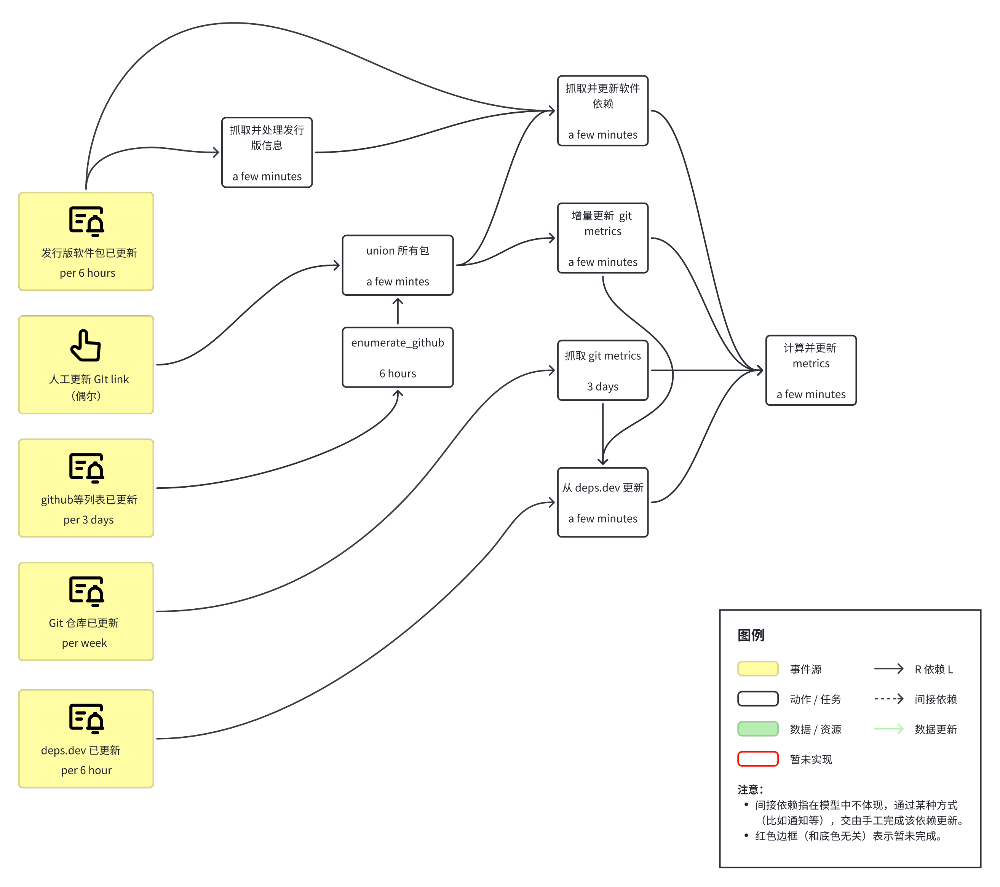

# Criticality Score

## Motivation

We would like to know the most critical and most downloaded open source software in the real world. With this goal, we select a few metrics different from [ossf/criticality_score](https://github.com/ossf/criticality_score/) and rate open source projects based on them.

Differences:

1. we use Linux downstream distributions as our dataset to evaluate the dependency of open source software, instead of github mention and deps.dev;
2. we only use metrics that can be collected from git repository, instead of only Github API;

## Design

## Overview

This project utilizes a structured workflow to automate and manage various software development tasks, primarily focused on  Git metrics collection, along with dependency management. Our automated processes are designed to enhance productivity and maintain up-to-date project metrics. Below, we detail the key components and the frequency of each task to give you a better understanding of our development operations.

## Key Tasks:

**Git platform Metrics Collection**: We periodically collect metrics from Git platform every 3 days to monitor project activity and performance. This helps in keeping track of contributions, issues, and other repository interactions that are crucial for project health.

**Git Metrics Acquisition**: Every week, we gather detailed metrics from Git to analyze code changes and repository evolution. This data is essential for assessing the progress and trends in our development practices.

**Git Link Sharing**: Every 6 hours, Git links are manually retrieved and shared among the team. This ensures that all team members have immediate access to the latest versions of repositories.

**Git platform Enumeration**: Conducted every 6 hours, this task involves a thorough enumeration of Git platform resources, such as Github, Gitlab, Gitee. It is crucial for identifying new repositories, forks, and branches that are relevant to ongoing projects.

**Dependency Management using deps.dev**: To maintain a robust and secure codebase, we use deps.dev every 6 hours to check and manage project dependencies. This tool helps us in identifying outdated libraries and potential security vulnerabilities.

**Union Task**: A quick, essential operation executed within a few minutes, the Union Task involves merging or consolidating data and resources. This operation is critical for maintaining the integrity and continuity of our codebase.

By automating these tasks, we strive to maintain high standards of efficiency and consistency in our development process. This README aims to provide a comprehensive guide to our project's workflow automation.

### Detailed Description of Flowchart Actions

This section provides a comprehensive overview of each action represented by the white boxes in the flowchart, along with the corresponding events that trigger these actions.

### Fetch and Process Release Information

- **Description**: This task is responsible for fetching and processing new release information to maintain an updated record of software releases. This step is crucial to keep our records up to date and typically takes only a few minutes to complete.
- **Triggering Events**:
  - Triggered by the **Release Repository Update** event, which occurs every 6 hours. This ensures that we effectively track and document the latest software versions as soon as they are available.

### Fetch and Update Software Dependencies

- **Description**: This task involves fetching and updating software dependencies from deps.dev or other reliable sources. It ensures that all dependencies are current and free from vulnerabilities. The process usually completes within a few minutes.
- **Triggering Events**:
  - Triggered by the **Fetch and Process Release Information** action, ensuring that any new software version has its dependencies up to date.
  - Also triggered by the **Union All Packages** task, ensuring that the consolidated package data includes the latest dependency information.
  - Triggered by the **Release Repository Update** event, ensuring all dependencies for the new version are always up to date.

### Git platform Enumeration

- **Description**: This action involves a thorough enumeration of Git platform resources, including all relevant projects, branches, and forks. It is a 6-hour task aimed at identifying and keeping track of all Git platformresources, ensuring an up-to-date view of Git platform activity.
- **Triggering Events**:
  - Triggered by the **Git Platform Repository List Update** event, which takes place every 3 days, to ensure that we capture the most recent repository information.

### Union All Packages

- **Description**: This task consolidates all previously collected package information into a unified dataset, creating a consistent and organized collection of data. It takes only a few minutes to complete.
- **Triggering Events**:
  - Triggered after **Git platform Enumeration** completes to merge all collected data.
  - Also triggered by the **Manual Git Link Update** event, ensuring that manually updated Git links are promptly included in the consolidated dataset.

### Incremental Update of Git Metrics

- **Description**: This task incrementally updates Git metrics based on the existing Git data to maintain accuracy. It is a quick task, requiring only a few minutes to execute, that ensures we always have the latest information.
- **Triggering Events**:
  - Triggered after the **Union All Packages** task is completed, ensuring that the latest package information is fully reflected in the Git metrics.

### Fetch Git Metrics

- **Description**: This task is executed every 3 days to fetch Git metrics, allowing for the analysis of code changes, repository evolution, and development activities. These metrics are crucial for understanding project progress and tracking contributions.
- **Triggering Events**:
  - Triggered by the **Git Repository Information Update** event, which occurs every week, to integrate the latest repository data into project analysis.

### Update from deps.dev

- **Description**: This task involves fetching and updating dependency information from deps.dev to maintain all dependency libraries up to date. This ensures that we are using the latest and most secure versions, and the process typically completes within a few minutes.
- **Triggering Events**:
  - Triggered by the **deps.dev Update** event, ensuring the latest dependency information is acquired from deps.dev.
  - Triggered by the **Fetch Git Metrics** action to ensure that the updated Git metrics include the latest dependency information.
  - Triggered by the **Incremental Update of Git Metrics** action to ensure consistency between incremental Git metrics updates and dependency information.

### Calculate and Update Metrics

- **Description**: This task integrates all previously gathered Git metrics and calculates project metrics to provide an overall assessment of project health. It completes in a few minutes and helps maintain a holistic view of all metrics data.
- **Triggering Events**:
  - Triggered after the **Incremental Update of Git Metrics** is completed, ensuring all metrics data is current and accurate.
  - Also triggered after **Fetch Git Metrics** completes, integrating newly gathered Git metrics data to provide the latest insights.
  - Triggered by the **Fetch and Update Software Dependencies** action to ensure any dependency changes are reflected in the metrics.
  - Triggered by the **Update from deps.dev** action to incorporate the latest dependency data into the metrics calculations.

## System Implementation

The whole system is organiazed in a Makefile and running in a cron job.

All the tasks are considered as targets in the Makefile, which is used to define the dependencies between the tasks and the commands to execute them. `make` is a tool that can be used to manage the dependencies of the tasks.

Every single task is usually implemented in Golang as a executable (some other tasks are implemented in Python). When some update task need to be triggered, the corresponding file is touched, (e.g. `packaged_updated` or `git_updated`) and then run `make` to update the ultimate task, `gen_scores`, and the whole system will be updated.

To update periodically, the system is running in a cron job. The cron job is a time-based job scheduler in Unix-like operating systems. After setting up the cron job, the system will update automatically at the specified time. Some jobs are running every 6 hours, some are running every 3 days, and some are running every week.

## Summary

This project uses an automated workflow to optimize software development tasks, focusing on Git platform and Git metrics collection, as well as dependency management, ensuring up-to-date metrics, improved productivity, and consistent code quality by automating tasks like fetching release information, updating dependencies, Git platform enumeration, and metrics updates.
