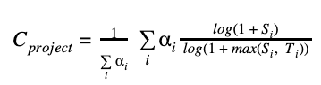

# Scores Module Documentation

## Overview

The scores module is responsible for calculating a criticality score for open source projects based on various metrics collected from package management ecosystems and Git repositories. This score assists in determining the importance and health of a project.

## Metrics Used for Score Calculation

The score calculation relies on several key metrics to evaluate the health and criticality of a project. These include:

- **Created Since**: Time since the project was created, measured in months.
- **Updated Since**: Time since the project was last updated, measured in months.
- **Contributor Count**: Total number of contributors to the project.
- **Commit Frequency**: Frequency of commits to the project repository.
- **Dependency Ratios**: Metrics derived from dependencies listed in package managers.
- **Organizational Count**: Number of organizations contributing to the project.

## Score Calculation Formula

The score is computed using a weighted sum of normalized values for each metric according to the following formula:



Where:

- \( C_{project} \) is the criticality score of the project.
- \( a_i \) represents the weight assigned to each metric.
- \( S_i \) represents the raw score of the metric.
- \( T_i \) represents the threshold value for the metric.

### Weights and Thresholds

Each metric is assigned a specific weight and a maximum threshold value used for normalization:

| Metric               | Weight \( w_i \) | Threshold \( T_i \) |
| -------------------- | ---------------- | ------------------- |
| Created Since        | 1                | 120 months          |
| Updated Since        | -1               | 120 months          |
| Contributor Count    | 2                | 40,000 contributors |
| Commit Frequency     | 1                | 1,000 commits       |
| Dependency Ratios    | 3                | 50                  |
| Distribution Ratios  | 3                | 50                  |
| Organizational Count | 1                | 8,400 organizations |

## Workflow for Score Calculation

1. **Fetch Project Data**: Retrieves metrics from the database for a specific Git link.
2. **Calculate Dependency Ratios**: Sum up the dependency ratios from various package managers using the `CalculateDepsdistro` function.
3. **Calculate Score**: Uses the `CalculateScore` function to compute the criticality score using retrieved and calculated metrics.
4. **Update Database**: `UpdateDepsdistro` and `UpdateScore` functions update the calculated dependency ratios and the final score in the database.

## How to Use the Scores Module

### Build and Installation

First, you need to build the project using the `make` command. Run the following command from the project's root directory to compile and install:

```
make
```

### Execution Command

After building, you can run the Scores module using the following command:

```
./bin/gen_scores -config=config.json
```

### Parameter Explanation

- `-config`: Specifies the path to the configuration file. The configuration file typically includes database connection details like host, port, username, password, etc. The default is `config.json`, but you can provide a different file if needed.

## Summary

The scores module provides a robust framework for calculating a criticality score for open source projects, using detailed metrics to rank and analyze their importance and health within the ecosystem.